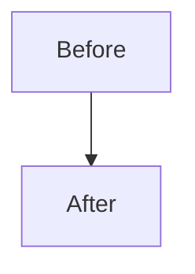

# GitHub Pull Requests

Use this skill when the user wants to create a GitHub PR, push a branch for a PR, or update an existing PR description.
Prefer `gh` commands for GitHub operations and plain `git` commands for local repository state.

## Requirements

- `gh` is installed and available on `PATH`.
- The current directory is inside a git repository with at least one remote.
- GitHub CLI authentication is available or can be completed by the user.

## Authentication

- Start by checking the GitHub CLI session: `gh auth status`.
- If the session is missing or expired, run `gh auth login` and continue only after authentication succeeds.
- If login requires browser or device-code interaction, ask the user to complete that step.
- If `gh` fails because network access is blocked, stop and tell the user to check agent permissions or network access before retrying.


## Commit and push (one step)

- Do not run the commit-and-push flow automatically from `main` or `master`; ask the user what branch or flow they want.
- Before creating a commit, inspect `git status --short` and review the diff for the files that appear relevant.
- Treat dirty worktrees carefully. Stage only the files intended for this PR, and use `git add -A` only when the user explicitly wants every change included.
- After staging the intended files, commit and push in one shell command when the user asks for a commit and the current branch is safe to push:
  - `git add <intended-files> && git commit -m "<message>" && git push`
- If there is nothing to commit, say so instead of running an empty commit.
- If no commit message was provided, infer a concise message from the diff or ask the user for one.

## Create PR

1. Prepare the PR body in a temporary file. Use the repository's PR template when one exists; otherwise use the default template below.
2. Populate the body from concrete context:
   - Summarize the diff, relevant commits, and user-provided notes.
   - Preserve required headings, checklists, and template language.
   - Use short TODO placeholders only for missing information that cannot be inferred, then ask targeted follow-up questions.
3. Create the PR with `gh pr create --body-file <file>`:
   - Set `--base` or `--head` when the inferred branches are wrong or ambiguous.
   - Add `--draft` when the user asks for a draft PR.
   - Include a ticket reference when the user gives one, or when it is obvious from the branch name, commits, or repository conventions.


### Default PR template
````text
# Summary

Describe the intention of the PR and the main behavior changed.

# Visualized

Optional. Include only when visuals help reviewers understand the change.
Add one or more named visuals. The visual heading is the attribution/name.

## New Component Tree

```text
src/
  feature/
    Component.tsx
    Component.test.tsx
```

Reviewer note: Explain what this visual is meant to clarify.

## Relation Diagram



Reviewer note: Explain what this diagram is meant to clarify.

# Validation

Describe what was used to verify the validity of this PR.
````

Notes:
 - Visualized section is optional.
 - Each visual or diagram in the Visualized section must have its own descriptive heading/name.

Example (adjust paths/flags as needed):

# create PR
```bash
gh pr create \
  --title "<title>" \
  --body-file /tmp/pr_body.md \
  --base <base-branch> \
  --head <head-branch>
```

## Update PR description

Update the PR with `gh pr edit` and `--body-file`.

Example:

```bash
gh pr edit <number-or-url> \
  --body-file /tmp/pr_body.md
```
